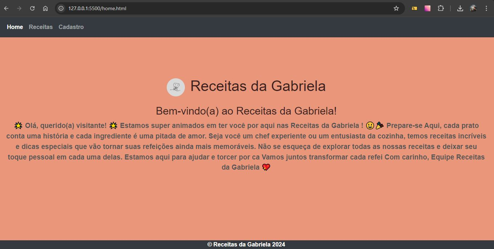
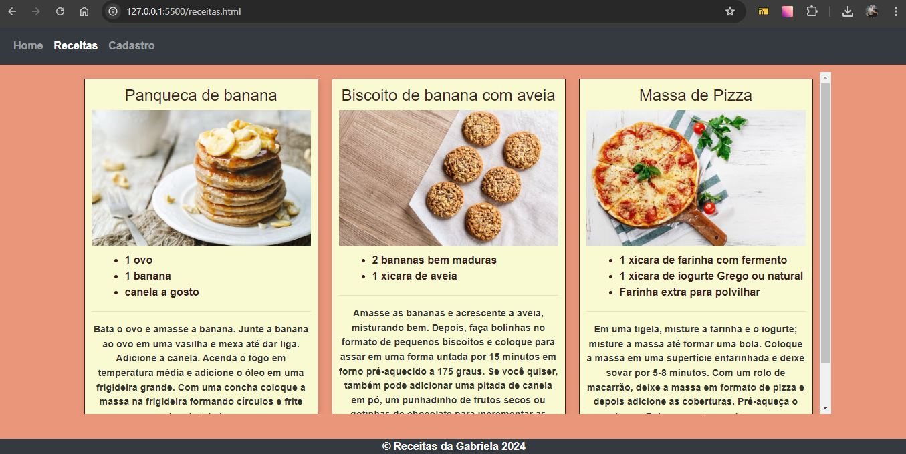
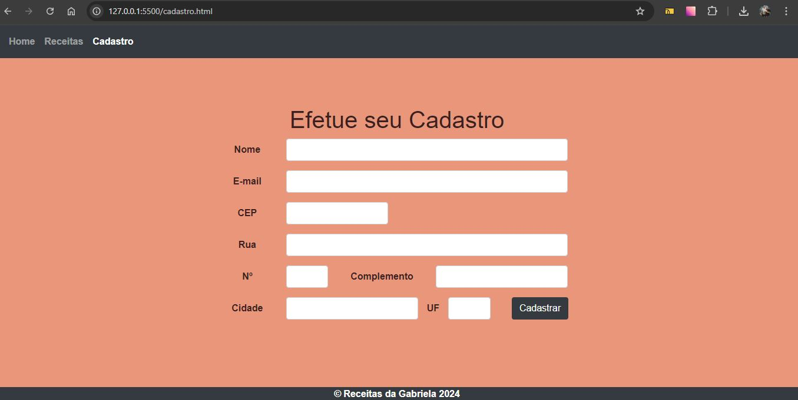

# Receitas da Gabriela

Bem-vindo ao projeto **Receitas da Gabriela**! Este é um site dedicado a compartilhar receitas deliciosas e práticas. O projeto inclui páginas para visualização de receitas e um formulário de cadastro para os usuários.

## Estrutura do Projeto

O projeto é composto pelas seguintes páginas e arquivos principais:

### Páginas HTML

- **home.html**: Página inicial do site, com uma mensagem de boas-vindas.
- **receitas.html**: Página com uma lista de receitas.
- **cadastro.html**: Página com um formulário de cadastro para novos usuários.

### Arquivos CSS

- **formatos.css**: Estilização geral do site.
- **responsive.css**: Regras específicas para tornar o site responsivo em diferentes tamanhos de tela.
- **receitas.css**: Estilização específica para a página de receitas.


## Tecnologias Utilizadas

- **HTML5**: Estrutura básica do site.
- **CSS3**: Estilização e design.
- **Bootstrap 4**: Framework CSS para uma melhor experiência de design responsivo.
- **JavaScript**: Funcionalidades interativas (não incluído diretamente, mas utilizado pelo Bootstrap).

## Funcionalidades

- **Navegação**: Menu de navegação responsivo.
- **Cadastro**: Formulário de cadastro que envia os dados por email.
- **Visualização de Receitas**: Exibição de receitas com imagens e instruções detalhadas.

## Responsividade

O site é projetado para ser responsivo, ajustando-se para diferentes tamanhos de tela, incluindo dispositivos móveis e tablets.

## Demonstração do Projeto

Veja uma breve demonstração do projeto em vídeo:


## Prints do Projeto

Aqui estão alguns prints do projeto para mostrar suas funcionalidades e layout:

### Página Inicial



### Página de Receitas



### Formulário de Cadastro



## Instruções para Desenvolvimento

1. **Clone o repositório**:
    ```bash
    git clone https://github.com/seu-usuario/receitas-da-gabriela.git
    ```

2. **Instale as dependências** (se aplicável):
    - O projeto não utiliza pacotes adicionais além do Bootstrap, que é carregado via CDN.

3. **Abra o projeto**:
    - Utilize um editor de código como VS Code para visualizar e editar os arquivos HTML e CSS.

4. **Visualize o projeto**:
    - Abra os arquivos HTML no seu navegador para visualizar o site.

## Contribuição

Se você deseja contribuir para o projeto, por favor, siga estas etapas:

1. **Fork o repositório**.
2. **Crie uma branch para sua nova feature**:
    ```bash
    git checkout -b minha-feature
    ```
3. **Faça suas alterações e commit**:
    ```bash
    git add .
    git commit -m "Descrição da minha feature"
    ```
4. **Envie para o repositório remoto**:
    ```bash
    git push origin minha-feature
    ```
5. **Crie um Pull Request**.


---

**Receitas da Gabriela** é um projeto open-source. Sinta-se à vontade para utilizar, modificar e compartilhar!

